## 初探linux json处理器jq

### 什么是jq

#### jq简介

其官网为：[jq](https://stedolan.github.io/jq/)

官网解释的是：“jq是一个轻量级且灵活的**命令行JSON处理工具**”。

由上，我们可以得出如下信息

- 轻量且灵活
- 命令行json处理工具

`jq`主要是由`c`语言编写，目前（2022年6月22日）最新版本为**1.6**(这个版本还是在2018年11月发布的)，其`github`地址为：https://github.com/stedolan/jq，我们可以像`sed`那样，使用`jq`来处理`json`数据，包括：切片、过滤等。

#### 我们为什么要用jq

我们或多或少，在编写`shell`的过程中，有需要解析`json`的需求，通常我们的做法是调用我们编写的高级程序，例如`python`来处理该`json`数据，然后再返回`shell`，若我们学习了`jq`后，我们无需外部调用即可处理`json`数据。

### 安装jq

#### `debian`系列

直接使用`apt`安装即可

apt-get install jq

#### `redhat`系列

直接使用`yum`安装即可

yum install jq

#### 版本查看

使用`jq --version`可以查看版本

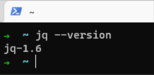

### 开始使用jq

通过例子的方式来逐步讲解jq的使用

假设你已经会基本的json

#### 将数据转换为`json`格式输出

我们使用`jq '.'`可以实现格式化输出

例如

我们需要格式化`{"id":0,"name":"pdudo","site":"juejin"}`

使用命令：`echo '{"id":0,"name":"pdudo","site":"juejin"}' | jq .`

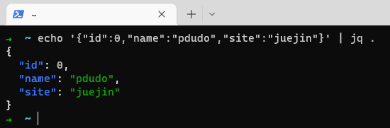

#### 获取json中某个key的值

可以使用`jq '.keyName'`来获取`keyName`的值

我们还是使用如上数据： `{"id":0,"name":"pdudo","site":"juejin"}`，我们将获取`name`的值

命令: `echo '{"id":0,"name":"pdudo","site":"juejin"}' | jq '.name'`

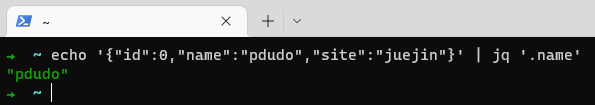

若想获取多个数据，可以使用`,`间隔，例如，我们不仅想获取`name`还想获取`site`的值

命令: `echo '{"id":0,"name":"pdudo","site":"juejin"}' | jq '.name,.site'`

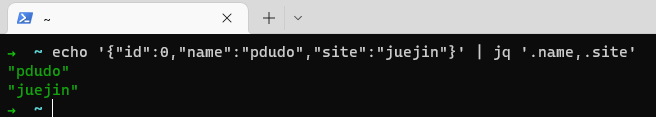

#### 将`json`中的key输出出来并且放到数组中

我们可以使用`jq 'keys'`将`json`中的`key`输出出来且放入数据中

例如

我们还是使用如上`json`数据

使用命令：`echo '{"id":0,"name":"pdudo","site":"juejin"}' | jq 'keys'`

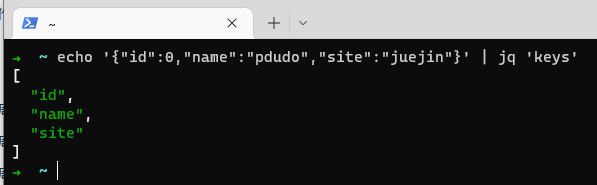

#### 获取json数组的长度

可以使用`jq '.|length'`来获取数组长度

`|`: 在`jq`中表示将上一个`jq`过滤器的输出作为下一个过滤器的输入，和`shell`管道类似

所以，我们想获取数组长度

例如，上一个案例，我们已经将`json`的`key`放入数组了，我们获取一下长度

命令： `echo '{"id":0,"name":"pdudo","site":"juejin"}' | jq 'keys' | jq '.|length'`

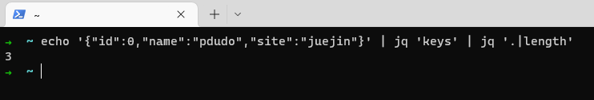

如上我们知晓`jq`中的`|`也会将上一个过滤器输出作为下一个过滤器输入，所以，我们可以直接在`js 'keys'`后加入`|length`

我们可以这么写：`echo '{"id":0,"name":"pdudo","site":"juejin"}' | jq 'keys|length'`，也可以获取数据

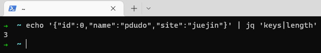

#### 获取数组指定数据

可以使用`jq '.[0]'`来获取下标为`0`的`json`数据，下标以此类推

例如有如下数据：`["id","name","site"]`

我们来获取下标为`0`和`1`的数据

命令: `echo '["id","name","site"]' | jq '.[0]'`

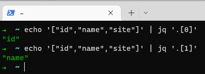

使用`jq '.[]'`是获取`json`的数组的所有数据

命令: `echo '["id","name","site"]' | jq '.[]'`

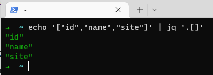

#### 为每个数组运行过滤器

我们可以使用`map`

一般我们很少单独使用`map`，都会和`select`配合使用，所以请直接看下一个案例即可

#### 使用`jq`赛选数据

我们可以使用`jq select()`赛选数据

例如，我们构建了如下数据

命令: `echo '{"info": [{"name": "bob","age": 32,"sex": 1},{"name": "tom","age": 58,"sex": 2},{"name": "tom","age": 58,"sex": 2}]}' | jq` 

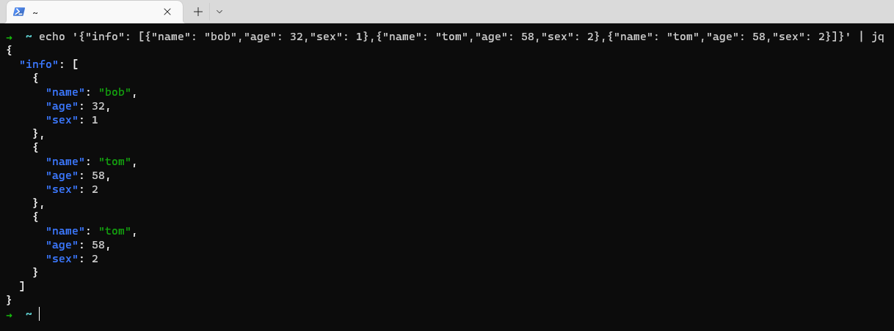

我们想赛选一下该`json`数据的`info`数组中`sex`为`2`的数据

这里先直接给出命令，后面再做逐步解析

命令: `echo '{"info": [{"name": "bob","age": 32,"sex": 1},{"name": "tom","age": 58,"sex": 2},{"name": "tom","age": 58,"sex": 2}]}' | jq '.info|map(select(.sex== 2))'`

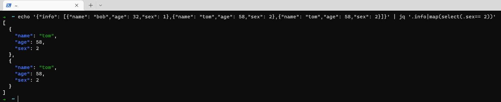

命令详细解释： 

若我们要想获取`sex`为`2`的数据,那么，首先我们的获取`info`的信息，如前面所述，我们可以使用`jq .info`获取`info`数组的信息

命令: `jq '.info'` 

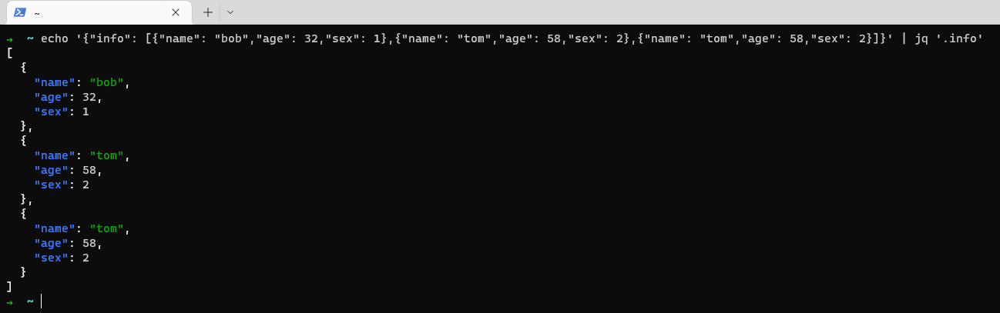

我们得到数据后，现在要进行计算，`map`进行包裹，然后使用`select`赛选数据，`map`将为输入数组的每个元素运行过滤器，`select`将对输入进行匹配，若结果为`true`则输出，否则不进行输出，所以我们组合下来则为`map(select(.sex== 2))`

结合上一个取`info`我们使用过滤管道，即可得到命令: `jq '.info|map(select(.sex== 2))'`

不仅如此，我们还可以利用该数据做数据比较

例如：我们想查询`age`大于50的数据

命令: `jq '.info|map(select(.age > 50))'`

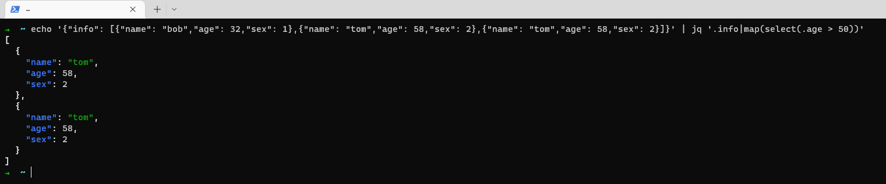

### 实际演示

我准备了一个实际案例，来讲解`jq`使用

#### 查询符合条件的`email`

假设有如下`json`数据，我们想要获取`age`大于等于`30`的`email`地址

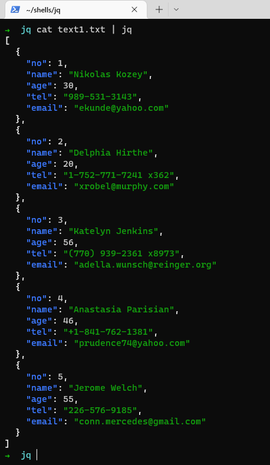

我们将上述文件放置在`text1.txt`文件中

我们可以这样来编写

命令: `cat text1.txt | jq '. | map(select(.age>=30)) | .[] | .email'`

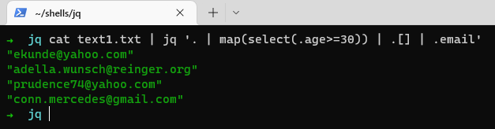

#### 查询符合条件的部分信息

如上面例子，我们想通过`age`大于等于`30`，且返回`name`和`tel`组成新的`json`

我们可以这样写

命令: `cat text1.txt| jq '.|map(select(.age>=30))|.[]|{"name": .name,"tel": .tel}'`

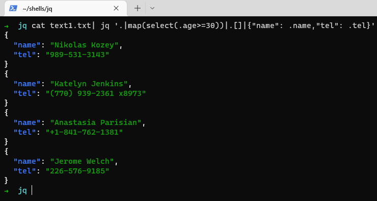

### 总结

对于`jq`而言，它是有学习成本的，若不介意在`shell`中嵌套`python`或者其他高级语言来处理`json`，也是可以的，但是单在`shell`或者命令行环境下，`jq`是处理`json`数据的不二之选，为了炫酷效果大可不必，解决问题才为第一要务。
