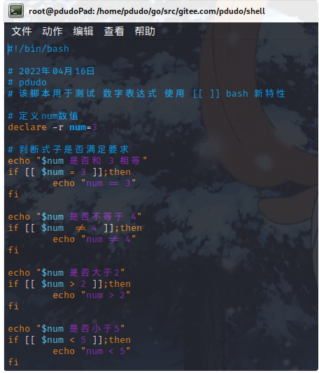

大家会`bash test`肯定会感觉到很陌生吧，但是你一定见过在`shell`中，使用这类语法:

if [ -f $xxx ];then 
... 
fi

其中`[ -f $xxx ]`就是`test`表达式

## 什么是test表达式

`test`是大名鼎鼎的`GNU`软件之一，为`Linux`的内置命令，表达式在`shell`中是用于检查文件状态检查、字符串运算 和 数值比较 的表达式

`test`返回状态值含义

- 0: 表达式结果为真(`true`)
- 1: 表达式结果为假(`false`)
- 2: 程序出错(`error`)

我们来看下返回值

我们可以发现，当表达式为`true`的时候，返回值为`0`，当表达式为`false`的时候，返回值为`1`，当表达式出现错误的时候，返回值为`2`。

`test`表达式可以简写为`[ ]`(小括号的形式)形式，关于这点，是`shell`比较弄混淆的一个点

我举例讲下

`test a = b`

等同于

`[ a = b ]`

`[]`格式如下

空格是不能省略的哦

脚本如下图

执行结果如下

前面介绍的差不多了，那我们开始看看`test`表达式了？

## 数值计算

`test`表达式中没有`>` `<``=``!=`这类符号(至少在`sh`中没有)

那我们怎么进行数值计算呢，`test`表达式给我们了一系列操作符

具体我们来看下

| **操作符** | **含义** |
| ------- | ------ |
| -nq     | 等于     |
| -ne     | 不等于    |
| -ge     | 大于或等于  |
| gt      | 大于     |
| -le     | 小于或等于  |
| -lt     | 小于     |

我们来尝试下

.png)

我们使用`debug`运行一下并且查看结果

你是否感觉到苦恼，实在是记不住`eq`、`ne`等应该怎么办

哎，不要急，`bash`提供了新的特性，可以使用`[[ ]]`来包含表达式，该表达式就可以写`=`、`!=`等，我们来尝试下

我们运行一下脚本，查看一下结果

注意: **这个特性是指的是**`**bash**`**,而使用**`**sh**`**则会出错**

我们使用一下`sh`执行一下，查看一下报错

## 字符串比较

对于字符串比较，`test`给我们提供的方法有 **比较2个字符串是否相等**、**比较2个字符串是否不相等**、**判断字符是否为空**、**判断字符串是否非空**

| **操作符**      | **含义**        |
| ------------ | ------------- |
| str1 = str2  | str1 等于 str2  |
| str1 != str2 | str1 不等于 str2 |
| -z str1      | str1 为空       |
| -n str1      | str1 不为空      |

好的，我们从案例中来看看具体含义

我们执行脚本来看下具体输出

## 文件/属性比较

`test`不仅只有 数值判断 和 字符串判断 ，更为强大的是，它还具有文件判断功能

由于判断类型比较多，所以，就只放常用的就行了

#### 文件判断

| **操作符** | **含义**    |
| ------- | --------- |
| -e      | 文件是否存在    |
| -f      | 文件存在且为 文件 |
| -d      | 文件存在且为 目录 |

我们看一个例子

我们新建目录 `pdudo_jujin_test`并且做3个判断，我们使用`test`来写表达式

#### 属性判断

| **操作符** | **含义**       |
| ------- | ------------ |
| -r      | 该文件是否有 读 权限  |
| -w      | 该文件是否有 写 权限  |
| -x      | 该文件是否有 执行 权限 |
| -s      | 该文件是否为非空     |

我们来看一个例子，我们新建一个空文件: `juejin_pdudo_files`，并且来判断属性，我们使用`[]`来写表达式

.png)

## 总结

我们总结了比较简单的使用，还有一些，我们作为高级特性来呈现，结合自身学习来看的话，一次性学习的太多，很容易弄混淆。

我们在进行数字比较的时候，若不想使用 `-eq`等表达式，可以尝试下使用`bash`特性，使用 `[[ ]]`包含表达式，例如: `=`、`!=`、`>`、`<`等，但是作为一般运维人员，使用`[[ ]]`是会被人耻笑的，且程序健壮性不强(`bash`特性，切换至其他`sh`脚本有可能会失败)，所以几乎尽量不使用`[[]]`包含表达式。

之所以`test`强大，是因为可以检测文件/属性判断，所以一直依赖，它都将是我们运维的利器，基础我们了解了，后期我们可以看看`test`表达式，适用于哪些脚本，将会如何呈现出来。
