## 容器之podman基础

### 1. 什么是Podman

**podman**是**红帽(Redhat)** 所研发的一款用于管理 `OCI`容器和`Pod`(**类似k8s pod 非 k8s pod**)的工具，`RedHat 8` 和 `Centos 8` 默认容器引擎 且 无守护进程的引擎，兼容**docker**，熟悉**dokcer**很容易上手**podman**。

### 2. podman 和 docker 的区别

#### 2.1 podman 和 docker 架构

podman

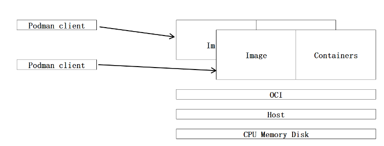


docker

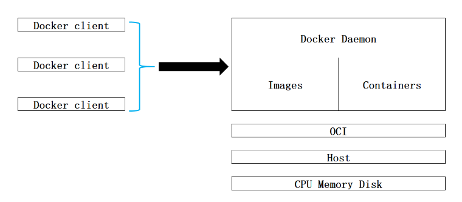


#### 2.2 podman 和 docker 区别

##### 2.2.1 守护进程

`docker` 采用守护进程模式来运行容器的

抽象出来即

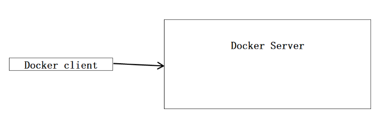


管理镜像/创建容器 均有`docker server`管理，典型的客户端/服务器架构

当我们启动 `docker`后，使用 `ps aux | grep docker-container`即可以看到该 守护进程

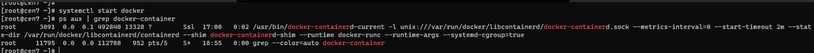


`docker`查看版本的时候，会呈现客户端和服务器的版本

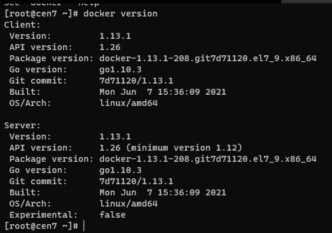


podman 采用无守护进程架构

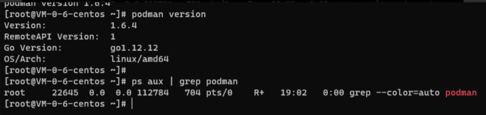


相比之下，`podman`闲置资源要低得多，即 若没有容器运行，则`podman`不会运行，而docker即使没有容器运行，也会启动一个`守护进程(docker Server)`

##### 2.2.2 安全

上节所述，`docker`使用守护进程模式，而 `podman`则使用的是无守护进程架构，那么2者到底有什么关系呢？

最主要的区别是: `docker`必须使用`root`权限 或者 在 `docker`群组中，才能使用 `docker`, 而 `podman`则无此限制。

我们模拟一下

**docker**

我们尝试新建用户，然后去使用`docker`操作新建镜像输出`hello world`。

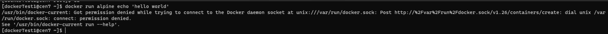


可见，报错了，报错原因是 权限不足，我们查看unix套接字的权限。

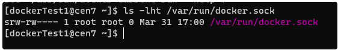


所以，需要`root/sudo`权限才行。

我们赋予dockerTest1 `sudo` 权限，再次尝试下。

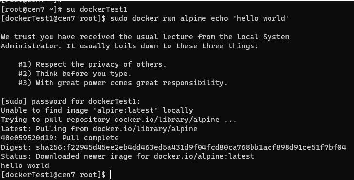


**podman**

我们使用普通用户登入测试`podman`机器，顺利启动容器，并且输出 `'hello world'`。


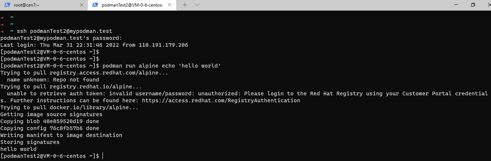

在别的用户下，使用`podman`是看不到这个容器的，`podman`能够做到容器隔离。


**总结**

若作为多用户而言，`podman`启动的容器是独立的，互不干扰，且不需要添加任何特权的情况下，均可运行，而`docker`启动的容器却是在一起的，只要有`docker server`权限，那么就可以操作所有容器，这是不安全的。

##### 2.2.3 镜像构建

`docker` 可以使用 `docker build`/`docker commit` 构建镜像，而 `podman` 则不行，它是为运行容器而编写的，而非创建镜像，创建镜像则需要交给其他工具: `Buildah` , 此外它还有一个兄弟: `Skopeo` ，后续再讲。

`podman`工具列举一下

`Buildah`： 用于构建、推送和签名容器镜像；

`Skopeo`：用于复制、检查、删除和签名镜像；

可见，`podman`是分模块处理的，而`docker`则是以一个整体来处理。

### 3. 如何快速入门使用podman

前文提到过，`podman`兼容`docker`，那么到底有多兼容呢，你甚至可以为 `podman`建立别名

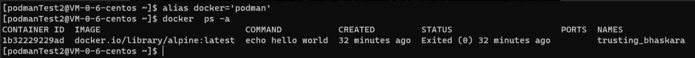

因此，你可以在开发中使用docker, 而线上环境中可以使用podman，因为它足够安全。

我们尝试下使用podman启动一个nginx服务器

命令参考

```
$ podman pull nginx
$ podman run -d --name nginx -p 8080:80 nginx
$ podman ps
$ curl 127.0.0.1:8080
```

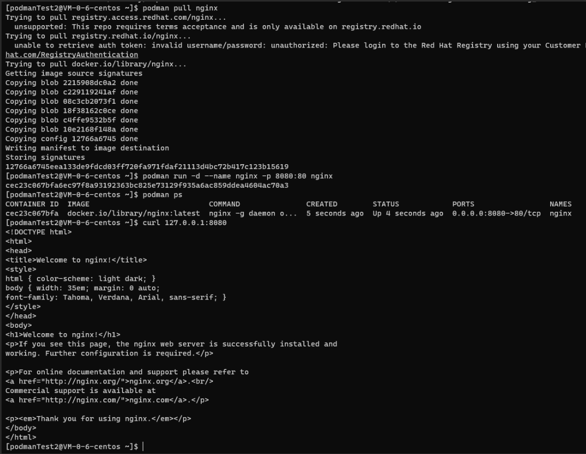

### 4.思考

为什么要使用`podman`，经过上面的对比，`podman`和 `docker`的差别不言而喻，而`podman`作为红帽的产品，有独特的优势，且是`docker`目前最好的替代品。

为什么`podman`能够运行`docker`镜像，或者说是能够'代替'`docker`

因为`docker`和 `podman`都符合OCI，所以得以兼容，就像上述所讲，你甚至可以在开发环境中使用`docker`管理容器，而在生产环境中使用`podman`, 因为它相比于`docker`，更加安全。
