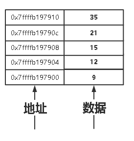
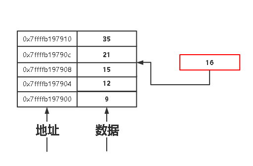
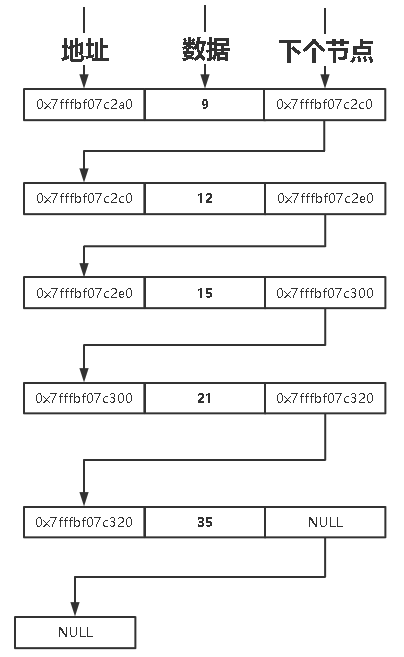
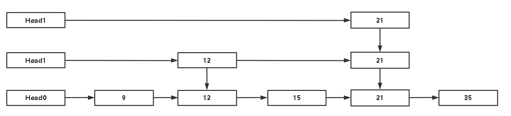
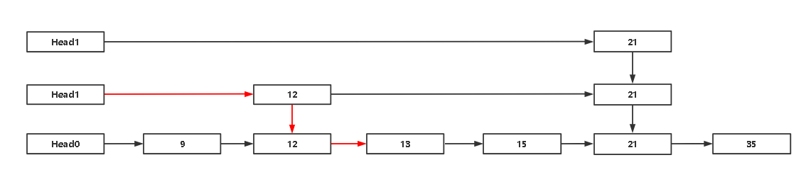
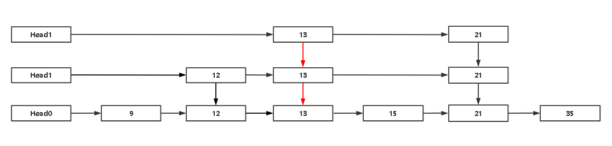
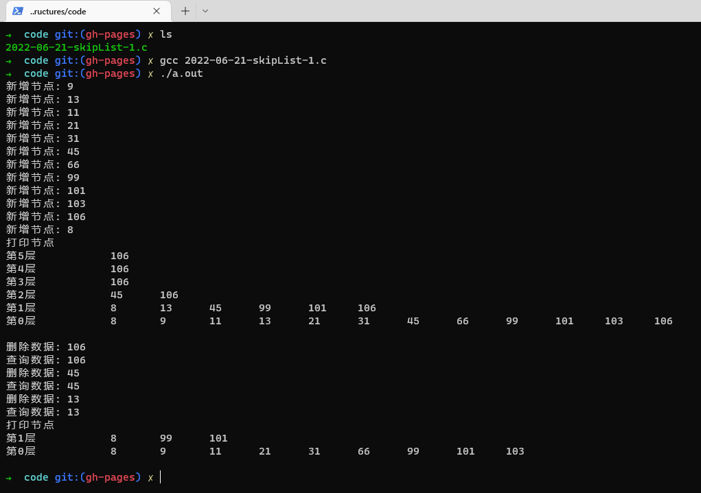

## 数据结构 跳跃表 C语言实现

> 时间：2022年6月21日
> 
> 标签：数据结构

### 什么是跳跃表

>  在解释这个之前，首先要看看 链表 和 数组 的区别，而后再来看跳表就容易的多了。

#### 数组

数组是用一组地址连续的存储单元以此存储线性表的数据元素，所以可以通过下标来获取

在申明数组的时候，需要指定大小

例如: int nums[5] = {9,12,15,21,35};

其内存图大概可以这样表示

对于**有序数组**而言，查找可以进行**二分查找**，提高查找效率。

若要对数组进行增加/删除等操作，会引发问题，例如，增加一个 16

这意味着，15以后的元素，都需要往后移位，才能插入这个元素，非常麻烦，而**链表**能够规避数组这一点。

#### 链表

链表节点由2部分组成，即: **数据域**和**指针域**，所以数据元素之间的逻辑关系是由**节点中的指针**来指示的。

同样存储 9,12,15,21,35 ，存储内存图，我们可以理解为如下：

由于节点的逻辑关系由节点中的指针来完成的，所以**添加/删除节点非常方便**(就不画了)，但是没办法通过下标来定位节点，所以没办法做**二分查询**。

#### 数组和链表的区别

- 数组需要在使用前提前规划长度，而链表不用

- 数组开辟的是连续内存地址空间，而链表是随机申请空间

-  数组寻址方式是靠下标，而链表是靠节点指针

#### 跳跃表

跳表是 **链表** + **索引** 的一种数据结构 ，是以**空间换取时间**的方式，可以对链表进行类似二分查找操作。

同样存储 9,12,15,21,35 ，跳跃表存储可能如下

> 所有的索引，都是真实实际的节点

在**链表**中要查询 15 这个节点

那么会遍历 9——12——15

在**跳表**中查询15这个节点

那么会遍历 12——15

当链表数据被无限拉大时，查询效果会逐渐提现出来

### 构建跳表

#### 构建前提

> 跳表比较好理解，但是实际用代码来表示，还是有点复杂的。
> 
> 实现的方法不唯一。

- 跳跃表的最大层数应当被提前定义

- 应当提前构建出跳跃表的头结点

#### 判断是否要建立索引

采用抛硬币的方式，建立一个随机函数，随机返回 **true** 或者 **false**

当一个数据节点被插入后，应当调用该随机函数，若 结果为 **false** 或者达到 **跳表最大层数** 则停止，否则应当在该层建立索引

#### 新增结点

跳表需要新增有序的数据结点，否则不能进行索引查询

**新增节点逻辑**

- 找到当前跳跃表最高有效层

- 进行索引逻辑判断，至最底层元素数据层(节点寻址路线需要记住)

- 进行节点插入

- 建立索引

假设有如下跳表：

我们新增结点**13**

通过抛硬币方式建立索引

> 假设建立随机索引函数一直都是true

删除和查找逻辑类似

### 跳表逻辑以及代码实现

#### 

#### 插入逻辑

- 初始化所有层的Head节点

- 在插入的时候，找到原始数据层，插入完毕后，进行向上建立索引

#### 查找逻辑

- 找到目前有效索引最高层

- 进行索引判断，定位到原始数据层

- 依序查找

#### 删除逻辑

- 按照查找 找到原始数据层

- 删除原始数据，并且判断该值是否有索引，若没有，则删除完毕，若有则删除索引

#### 运行效果

代码: [2022-06-21-skipList-1.c](code/2022-06-21-skipList-1.c)

我们先向该跳表中插入`9,13,11,21,31,45,66,99,101,103,106,8` 元素，而后打印目前的调表，再删除`106,45,13` 元素，再打印跳表。

从上述结果来看，我们跳表基本上已经写完了。
