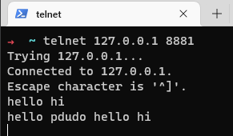
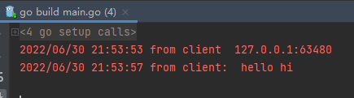
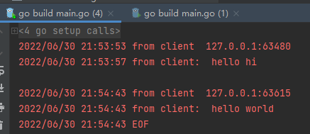
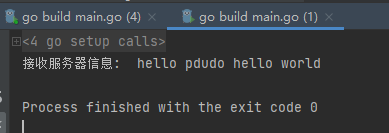
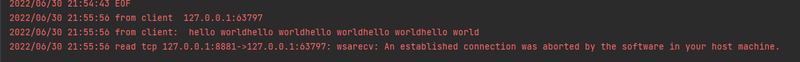
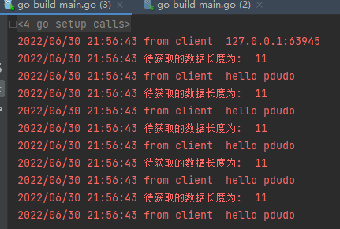

## 完成一个简单的TCP服务器

## 网络通信的方式有哪些

我们对于网络通信方式而言，大概可以分为以下三类方式

- 客户端/服务器结构
- P2P结构
- 混合结构

### 客户端/服务器结构

客户端/服务器通信方式通常称为`C/S`(`client`/`server`)通信方式，它作为网络中最典型、最基本的通信结构。

在通信过程中，服务器先启动服务，分配套接字，由客户端连接服务器，进行通信，在此过程中，客户端为主动方，服务器为被动方。客户端和客户端不允许直接通信。

这里提一点，很多文章说的`B/S`通信，本质上也是`C/S`通信哈。

### P2P结构

在P2P通信中，通信双方都是对等关系，也就是说，P2P结构中，通信双方既可以作为服务器，又可以作为客户端。

### 混合结构

顾名思义，混合结构就是既有服务器存在，又有对等网存在，不过一般是先和服务器建立连接后，进行获取其他客户端套接字，然后进行通信。

### 总结

我们虽然区分了三种网络通信方式，但是从另一点来看，如果想要提供服务器，那么就需要提前开启服务并且分配一个套接字，等待别的客户端通过这个套接字连接上来，所以说`C/S`结构才是最基本的通信方式。

## 编写一个简单的TCP服务器/客户端

### 服务器

```go
package main

import (
    "log"
    "net" // 引入net库
)

func main() {
    // 建立一个TCP服务器 监听 0.0.0.0:8881
    listen , err := net.Listen("tcp","0.0.0.0:8881")
    if err != nil {
        panic(err)
    }

    for {
        // 使用accept函数等待监听客户端的连接上来
        conn, err := listen.Accept()
        if err != nil {
            continue
        }

        // 将每个连接都开一个协程
        go worker(conn)
    }
}

func worker(conn net.Conn)  {
    // 打印一下客户端地址
    log.Println("from client " , conn.RemoteAddr())

    // 设置接收来自客户端的 byte , 大小为: 1024个字节
    buf := make([]byte,1024)

    for {
        // 读取客户端发送的字节
        n , err := conn.Read(buf)

        if err != nil {
            log.Println(err)
            conn.Close()
            return
        }

        // 将了互动发送的信息打印出来
        log.Println("from client: " , string(buf[:n]))

        // 将客户端发送的字符追加一下再回传给客户端
        _ , err = conn.Write(append([]byte("hello pdudo "),buf[:n]...))
        if err != nil {
            log.Println(err)
            conn.Close()
            return
        }
    }
}
```

如上所述，我们使用`net.Listen("tcp", "0.0.0.0:8881")`来监听所有网卡的`8881`端口，这就是套接字

我们使用 `listen.Accept()`该函数会等待一直到客户端连上服务器，若连接后，我们就得到了一条连接

`conn.Read(buf)`表示从连接中读取数据，并且写入我们新建的`byte`数组中

使用 `conn.Write(append([]byte("hello juejin pdudo "), buf...))`将数据写入该连接

最后使用 `conn.Close()`来关闭该连接。

写完我们可以运行起来，然后使用`telnet` 来简单测试一下

使用`telnet 127.0.0.1 8881`可以连接进我们新写好的服务器，我们输入字符`hello hi`，服务器返回了我们`hello pdudo hello hi`



我们查看服务器日志



### 客户端

我们再写个客户端在看看

```go
package main

import (
    "fmt"
    "net"
)

func main() {
    // 使用net.Dial连接tcp服务器
    conn , err := net.Dial("tcp","127.0.0.1:8881")
    if err != nil {
        panic(err)
    }

    // 使用  hello pdud 发送一个"hello world"
    conn.Write([]byte("hello world"))

    buf := make([]byte,1024)

    // 接收服务器信息
    n , _ := conn.Read(buf)
    fmt.Println("接收服务器信息: ",string(buf[:n]))

    // 断开连接
    conn.Close()
}
```

### 测试

我们先启动服务器

启动服务器后并启动客户度

服务器日志



客户端日志



由此，我们一个简单的服务器和客户端便写好了

## 什么是粘包

### 模拟粘包

我们常说，`tcp`是流，建立握手连接后，该TCP连接就像水一样，源源不断的通信，我们没办法区分哪儿是数据的头，哪儿是数据的尾，所以才会出现粘包的东西

那我们可以尝试一下粘包

我们修改一下客户端

```go
package main

import (
    "net"
)

func main() {
    // 使用
    conn , err := net.Dial("tcp","127.0.0.1:8881")
    if err != nil {
        panic(err)
    }

    for i:=0;i<5;i++ {
        // 使用write发送一个"hello world"
        conn.Write([]byte("hello world"))
    }

    // 断开连接
    conn.Close()
}
```

我们只发送，不接受，看看服务器收到的日志

先启动服务器，然后启动客户端，我们得到的日志`是`这样的？



揉成一团来发了。本来我们发送的条数是5条，但是服务器接受到的就这一条，这就是粘包。

### 如何避免粘包

如上所述，我们出现粘包的原因是: **没有办法确定需要发送/需要接受数据的长度**，那如果我们能够确认发送/接受的数据，不就可以避免粘包了么。

那我们可以在发送的数据前面，加一个数据，这个数据就是字符的长度，例如，

我们想发送一个字符串: "hello juejin pdudo"，按照我们之前设想的，模拟出来应该是这样的


我们如何写入18这个数据呢？ 这就引入了我们下面介绍的，什么是大端序和小端序

### 什么是大端序/小端序

早些时候，计算机 比 网络要出现的早，各自搞各自的，其中和字节顺序有关的是，如何存储这类垮字节的数据，出现了2个极端，一个认为最低有效字节在前，一种认为最高有效字节在前，所以出现了 大端序 和 小端序

我们将**低字节放在前面的方法**，我们称之为 **小端法**

反之，我们**将高字节放在前面的方法**，称之为 **大端法**

后面网络出现了，使得这2种计算机通信起来有问题，未必避免这种情况，那么就会规定一下该操作使用什么大端序或者小端序，例如我们之前看的dns协议，就是使用的大端序，所以我们需要拿到数据包后，解一下字节序。

具体什么意思呢？

我们来看下，假设我申请了一个 无符号32位整形数据 ，我们为其赋值为 8

那么它的字节图应该是这样的


我们按照大端和小端来看一下

小端序


大端序


为什么我们上面定义的简单服务器中发送字符为什么没有使用大端或者小端呢？

如前面所讲，大端序和小端序对应的是多个字节，而我们使用的字符是一个字节，不管怎么排，都没有问题。

### 解决粘包问题

我们了解了如何避免粘包，以及字节排列顺序，所以，我们实现一下如何避免粘包

我们规定有4个字节来存储字符的长度嘛

我们在`golang`中使用`encoding/binary`来实现相应的字节序

我们使用

```go
// 读取前4个字节
recv_len := 0
for recv_len < 4 {
 n, err := conn.Read(headBuf[recv_len:])
 if err != nil {
 conn.Close()
 return
 }
 recv_len = recv_len + n
}
```

来确保读取这么长的字节

我们看看修改后的服务器

```go
package main

import (
    "encoding/binary"
    "log"
    "net" // 引入net库
)

/*
    2022年6月30日
    pdudo
    编写一个简单的TCP服务器,每当收到消息后，都将这条消息返回回去，并且关闭该连接
*/

func main() {
    // 建立一个TCP服务器，监听 0.0.0.0:8881
    listen, err := net.Listen("tcp", "0.0.0.0:8881")
    if err != nil {
        panic(err)
    }

    for {
        // 使用accept函数等待监听客户的连接上来
        conn, err := listen.Accept()
        if err != nil {
            continue
        }

        // 将每一个连接都开一个协程
        go worker(conn)
    }
}

// worker 函数
func worker(conn net.Conn) {
    // 打印一下客户端地址
    log.Println("from client ", conn.RemoteAddr().String())

    for {
        // 读取一下字节长度
        var headLen uint32
        headBuf := make([]byte, 4)

        // 读取前4个字节
        recv_len := 0
        for recv_len < 4 {
            n, err := conn.Read(headBuf[recv_len:])
            if err != nil {
                conn.Close()
                return
            }
            recv_len = recv_len + n
        }

        // 使用小端序
        headLen = binary.LittleEndian.Uint32(headBuf)
        log.Println("待获取的数据长度为: ", headLen)

        // 设置接收的长度
        buf := make([]byte, headLen)

        // 读取实际的数据
        recv_len = 0
        for recv_len < int(headLen) {
            // 读取客户的发送的字节
            n, err := conn.Read(buf[recv_len:])
            if err != nil {
                conn.Close()
                return
            }
            recv_len = recv_len + n
        }

        // 打印出来
        log.Println("from client ", string(buf))
    }
}
```

修改后的客户端

```go
package main

import (
    "encoding/binary"
    "log"
    "net"
    "time"
)

func main() {

    // 使用net.Dial 连接上服务器
    conn , err := net.Dial("tcp","127.0.0.1:8881")
    if err != nil {
        panic(err)
    }

    for i:=0;i<5;i++ {

        // 定义待发送的字符串
        msg := "hello pdudo"

        // 获取字符串长度
        msgLen := len(msg)


        // 使用小端封装长度
        headBuf := make([]byte,4)

        binary.LittleEndian.PutUint32(headBuf,uint32(msgLen))

        // 先发送长度数据
        sendLen := 0
        for sendLen < 4 {
            n , err := conn.Write(headBuf[sendLen:])
            if err != nil {
                log.Println(err)
                conn.Close()
                return
            }
            sendLen = sendLen + n
        }

        // 发送实际数据
        sendLen = 0
        for sendLen < msgLen {
            n , err := conn.Write([]byte(msg)[sendLen:])
            if err != nil {
                log.Println(err)
                conn.Close()
                return
            }
            sendLen = sendLen + n
        }
    }

    time.Sleep(100 * time.Second)
    // 断开连接
    conn.Close()
}
```

编译服务器 和 客户端并且执行

先开启服务器，然后再启动客户端

查看服务器日志



## 思考

我们网络通信的方式，不管是客户端/服务器、P2P 还是 混合 ， 其本质还是 客户端/服务器 通信，只不过后两者，在前者基础上做了改变而已。

我们实现通信使用的是套接字，套接字就是 `ip`+ `端口`

而后我们实验了最简单的TCP服务器，引出了“粘包”的问题。而粘包的问题本质是： TCP连接是流，无法判断数据开头和结尾，从而导致粘包，而解决粘包的方式是，我们发送数据的时候，先获取待发送数据的长度，然后将长度和数据一起发过去，接收数据的时候，先接收长度，然后根据长度，接收实际数据，这样就能避免粘包。
