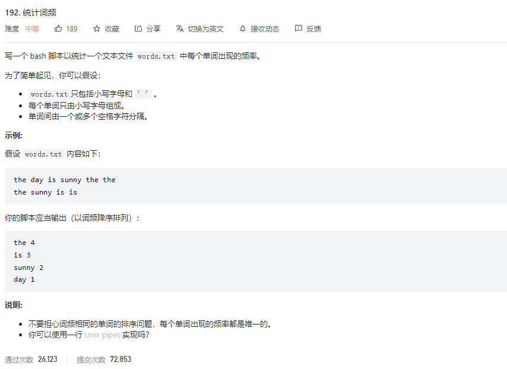
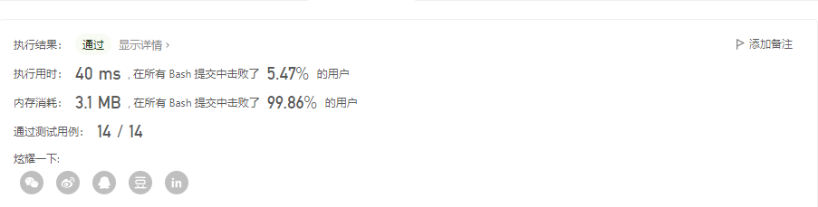
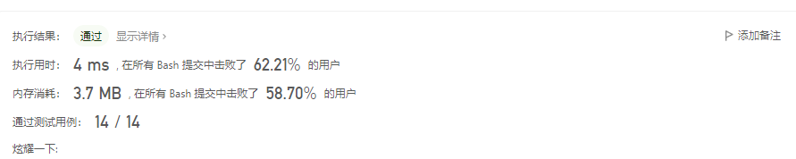
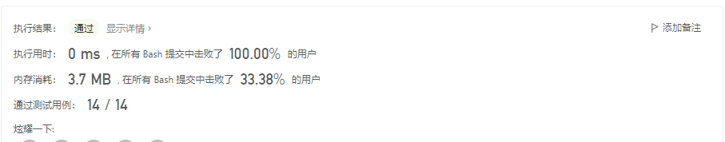
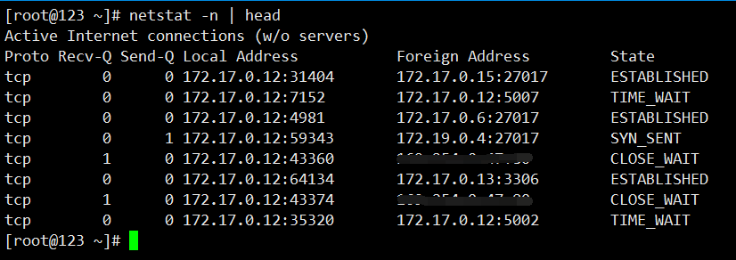
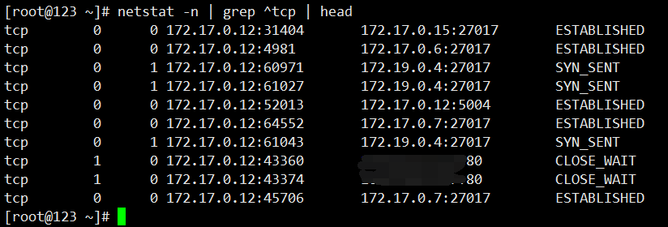
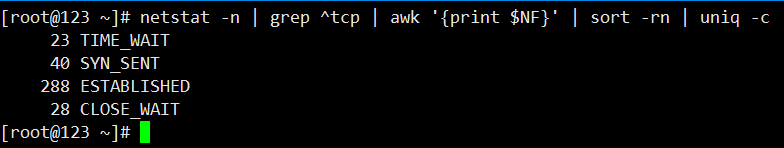
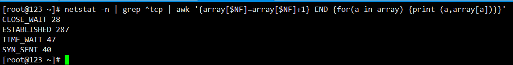

## 力扣-192-统计词频

> 时间：2022年6月15日
> 
> 标签：shell


### 题目




### 问题分析

该题目需要将 `words.txt`的内容进行统计个数，并且按照降序排序

```textile
the day is sunny the
the the sunny is is
```

该题目无非就是将单词逐个统计出来，进行计数，最后根据计数来进行降序排序。


### 使用数组解决问题

我们将文本数据按照空格遍历出来，将单词作为`key` 存储`map` 中，这样最后仅需要遍历`map`就可以解决该问题。

我们编写代码

```bash
#!/bin/bash

# 定义字符型数组，后续简称map 
declare -A dict

# 遍历数据， 填充 map
while read line
do
        for xx in $line
        do
                dict[$xx]=`expr ${dict[$xx]} + 1`
        done
done < words.txt

# 打印 map 中的数据且使用sort进行排序
for key in ${!dict[*]}
do
        echo -e "$key ${dict[$key]}"
done | sort -k 2 -rn
```


这里简单提一嘴

数组我们分为数组型数组，也可以分为字符型数组，这里简单解释下2者之间的区别和底层实现。

这里所述的`map` 在`shell` 中是指字符数组，例如我们常见的数组是这样的:

```bash
a[0] = 1
a[1] = 2
a[2] = 3
```

而在`shell` 中，我们申请字符型数组后，我们可以这样定义:

```bash
a["1"] = 2
a["2"] = 3
a["0"] = 1
```

而不管是数字数组和字符数组，其底层是使用`hash` 存储的，我们可以使用如下案例来验证

```bash
#!/bin/bash

# 定义数字型数组
declare -a array

# 分别在下标0 1 和 100 塞入数据
array[0]=1
array[1]=2
array[100]=101

# 打印数组长度 数组下标 以及 数组数据
echo "数组长度: ${#array[@]}"
echo "数组下标: ${!array[@]}"
echo "数组数据: ${array[@]}"
```

我们将代码执行后可得出数据，在`shell` 中存储数组是用的`hash` 而非真的开辟一段连续的数组。

好，我们提交代码后截图如下




### 使用命令+管道方式解决问题

在上述中，我们使用`while` 已经将单词给分割开来了，接着我们灵活应用命令和管道，来解决该问题。

> 注意该方法是在`bash` 中进行测试的，若不是`bash` 请切换至`bash` 进行尝试。


先对单词进行排序

```bash
while read line; do for xx in $line; do echo $xx; done; done < words.txt | sort
```

结果

```bash
day
is
is
is
sunny
sunny
the
the
the
the
```

使用`uniq` 命令对单词进行统计

```bash
while read line; do for xx in $line; do echo $xx; done; done < words.txt | sort | uniq -c
```

结果

```bash
1 day
3 is
2 sunny
4 the
```

因为我们需要的单词在前，数字在后，所以，我们还需要调整一下，可以使用`awk` 交换一下列的顺序

```bash
while read line; do for xx in $line; do echo $xx; done; done < words.txt | sort | uniq -c | awk '{print $2 " " $1}'
```

然后进行排序即可

```bash
while read line; do for xx in $line; do echo $xx; done; done < words.txt | sort | uniq -c | awk '{print $2 " " $1}' | sort -k 2 -rn
```

提交代码




### 使用awk解决问题

`awk` 的解决方法和第一种方法类型，也是将单词作为`key` ，出现的次数作为值，这里直接给出脚本即可。

```bash
gawk '
{
        for (i=1;i<=NF;i++) {
                S[$i]=S[$i]+1
        }
}

END {
        for (a in S) {
                print (a,S[a])
        }
}
' words.txt | sort -rn -k 2
```

提交代码




### 总结

在`shell` 中，我们经常会有统计出现的次数的需求，我们一般使用`awk` 可以完成，例如，我们想统计目前服务器中的`tcp` 连接状态值，我们可以使用`awk`这么写

```bash
netstat -n | grep ^tcp | awk '{array[$NF]=array[$NF]+1} END {for(a in array) {print (a,array[a])}}'
```


我们来剖析一下该命令/脚本


`netstat -n` 显示连接上服务器的连接信息，以`ip` 地址展示，而非由域名，我们可以得到类似于下面这样的。



由于抓出的协议不仅有`tcp` 还有`udp` 和`unix socket`，所以我们需要用`grep` 来赛选一下由`tcp` 开头的行，使用`grep` 后，我的得到的信息大概是这样的。



现在要获取`State`出现的次数，我们可以使用`awk` 先将最后一列输出来，然后排序，再`uniq` 一下，就能得到结果。



我们还可以使用`awk` 做统计，其原理和我们上述`awk` 解决方案一致，我们将`state` 列的字符作为`key` ，将出现的次数作为值，而后输出数组的值即可，我们也能顺利写出来，命令执行后如下。



从上述来看，我们使用`awk` 来统计类似的信息还是非常不错的。


