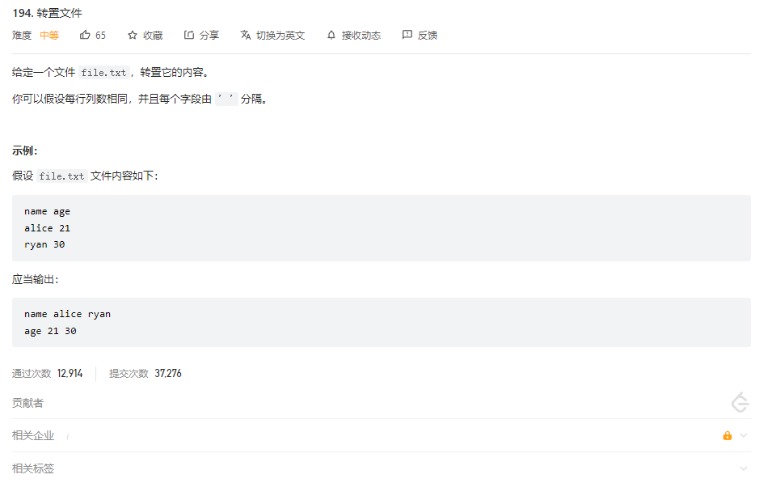
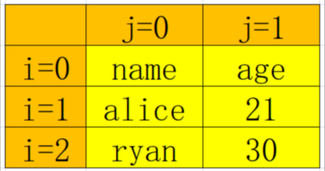
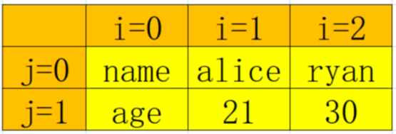
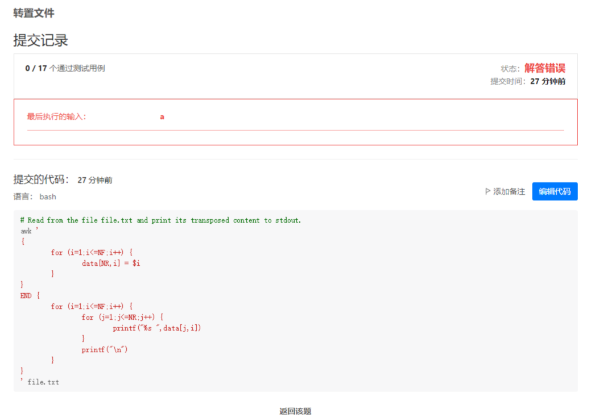

## 力扣-194-转置文件

### 题目描述



### 问题分析

该题目需要我们将文件内容给置换过来，例如，将`file.txt` 文件内容如下:

```bash
name age
alice 21
ryan 30
```

需要置换为

```bash
name alice ryan
age 21 30
```

这种题目无非就是利用数组之类的，将数据存储起来，然后进行翻转。

### 利用数组解决问题

看到这种问题，第一想到的是，awk的二维数组(awk 并不支持二维数组，只是用一维数组模拟而来的)，可以将问题数据存入 数组中，数据格式如下



换种输出方式，即可达到题中所述(其实数组数据并未改变)



那么如何获取数据的 列数 和 行数呢？

我们可以引入 awk 内置变量

NF: 列数

NR: 行数

于是乎，我们可以将脚本编写如下

```bash
awk '
{
        for (i=1;i<=NF;i++) {
                data[NR,i] = $i
        }
}
END {
        for (i=1;i<=NF;i++) {
                for (j=1;j<=NR;j++) {
                        printf("%s ",data[j,i])
                }
                printf("\n")
        }
}
' file.txt
```

提交代码却发现抛错了



经过仔细的比对，我发现，自己脚本输出的有一个空格 ， 而黑色测试中的，并没有该空格，这。。。从提交记录或者报错界面上看，怎么能够发现的了呢(果然 空格 才是最大的bug吧。。。前些天刚栽了一波坑，这次又来。。。)

无奈，又改写代码，将最后一列的空格删除掉

代码如下

```bash
awk '
{
        for (i=1;i<=NF;i++) {
                data[NR,i] = $i
        }
}
END {
        for (i=1;i<=NF;i++) {
                for (j=1;j<NR;j++) {
                        printf("%s ",data[j,i])
                }
                printf("%s\n",data[j,i])
        }
}
' file.txt
```

再次提交，通过了。

### 利用其逻辑结构解决问题

对于方案1 中的暴力求解，太蠢了，所以想寻求有没有一种不用存储其值的方案

假设我能够取出第一列，并且将它转换为 一行，不就解决了么？

元素数据

```bash
name age
alice 21
ryan 30
```

命令

```bash
cat file.txt | awk '{print $1}' | tr -t '\n' ' '
```

执行的结果

```bash
name alice ryan
```

新的问题来了，我怎么样求文件的列数呢？

如1 所示，`awk`  `NF`  可以求出 列数，我们于是乎，可以这么写

```bash
awk '{print NF}' file.txt
```

输出的结果

```bash
2
2
2
```

这明显不是我们想要的，我们想要第一行即可，我们可以这么写 `awk '{print NF}' file.txt | head -n 1`

其实还可以这么写 `awk '{if(NR==1){print NF;exit}}' file.txt`

判断是否为第一行，若为第一行，则求出列数，并且退出awk

好的，我们组装一下该脚本，即为

```bash
#!/bin/bash

readonly fileName="file.txt"

column=`awk '{if(NR==1){print NF;exit}}' $fileName`

for i in `seq $column`
do
        awk "{print \$$i}"  $fileName | tr -t '\n' ' '  | sed 's#[ ]*$##g'
        echo  ""
done
```

至于 `sed 's#[ ]*$##g`其实是将每行最后的空格给替换掉,至于为什么，如方案1 错误所示。

`readonly`是只读变量，也可以写为: `declare -r`

肯定还有更为简单的方法，算了，不想了。

溜了 溜了


### 总结

其实从解法1 和 解法2 中，我们都不难看出，其中有`awk` 的影子，`awk` 在处理这种列的文字的时候，可谓是得心应手，所以，还是要学习一下`awk` 才是王道。


